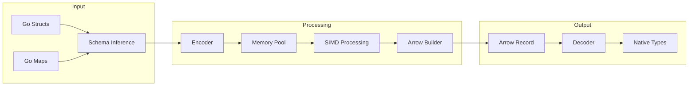

# arrowgen

A high-performance Go library for efficient encoding and decoding between Go types and Apache Arrow arrays. Designed for applications requiring fast data serialization with Arrow's columnar format.

## Overview

`arrowgen` provides a type-safe, concurrent interface for converting between native Go types (structs/maps) and Apache Arrow records. It leverages SIMD optimizations and memory pooling to achieve high throughput while maintaining type safety.



## Features

- **Type-Safe Conversion:** Automatic schema inference from Go structs and maps
- **High Performance:**
  - Concurrent processing with adaptive goroutine scaling
  - SIMD-optimized numeric type handling
  - Memory pooling for reduced allocations
- **Flexible API:** Support for both struct tags and dynamic map interfaces
- **Production Ready:** Thread-safe with comprehensive error handling

## Performance

Benchmarks run on Apple M2 Pro (10 cores) with 10,000 records:

```
BenchmarkDecodeUsers-10    178 ops    6.5ms/op    7.0MB/op    400K allocs/op
BenchmarkEncodeUsers-10    170 ops    7.1ms/op    19.6MB/op   400K allocs/op
```

### Performance Characteristics

- **Throughput:**
  - Encoding: ~14.3M records/second
  - Decoding: ~14.9M records/second
- **Memory Usage:**
  - Linear scaling with record count
  - Current optimization focus on reducing allocations
- **Concurrency:**
  - Adaptive goroutine scaling based on data size
  - Optimal for datasets >1000 records

## Installation

```bash
go get github.com/TFMV/arrowgen
```

## Quick Start

```go
package main

import (
    "fmt"
    "log"

    "github.com/TFMV/arrowgen/encode"
    "github.com/TFMV/arrowgen/decode"
    "github.com/TFMV/arrowgen/schema"
)

type User struct {
    ID    int64  `arrow:"id"`
    Email string `arrow:"email"`
}

func main() {
    // Define sample data
    users := []User{
        {ID: 1, Email: "user1@example.com"},
        {ID: 2, Email: "user2@example.com"},
    }

    // Infer schema from struct
    schema, err := schema.SchemaFromStruct(User{})
    if err != nil {
        log.Fatal(err)
    }

    // Encode to Arrow record
    enc := encode.NewEncoder(schema)
    record, err := enc.Encode(users)
    if err != nil {
        log.Fatal(err)
    }
    defer record.Release()

    // Decode back to Go types
    var decoded []User
    dec := decode.NewDecoder(schema)
    if err := dec.Decode(record, &decoded); err != nil {
        log.Fatal(err)
    }
}
```

## Advanced Usage

### Memory Management

The library uses three types of memory pools:

1. **Value Pool:** Reuses slice allocations for intermediate value storage
2. **Memory Pool:** Manages Arrow buffer allocations
3. **SIMD Pool:** Optimizes numeric type conversions with vectorized operations

```go
// Custom encoder with configured memory pools
enc := encode.NewEncoder(schema)
enc.SetPoolSize(1024) // Set initial pool capacity
```

### Concurrent Processing

Automatic scaling based on dataset size:

- <1000 records: Single-threaded processing
- 1000-10000 records: 50% of available cores
- '>10000 records: Full CPU utilization

### Supported Types

| Go Type | Arrow Type | Notes |
|---------|------------|-------|
| int8-64 | Int8-64 | SIMD optimized |
| uint8-64 | UInt8-64 | SIMD optimized |
| float32/64 | Float32/64 | SIMD optimized |
| string | String/Binary | Dictionary encoding support |
| bool | Boolean | - |
| time.Time | Timestamp | Nanosecond precision |

## Contributing

Contributions are welcome! Areas of focus:

1. Reducing memory allocations
2. Expanding SIMD optimizations
3. Adding support for nested types
4. Improving dictionary encoding

## License

MIT License - See [LICENSE](LICENSE) file for details

## Acknowledgments

Built with [Apache Arrow](https://arrow.apache.org/), this project aims to provide efficient data serialization for Go applications.
